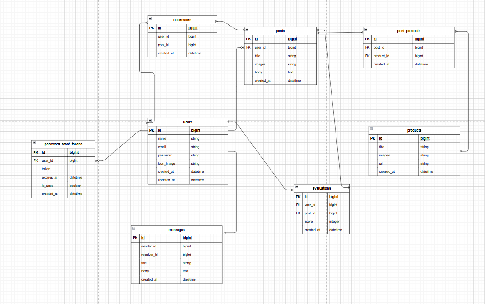

### ER図

### 本サービスの概要（700文字以内）
本サービスはPC部屋の写真を投稿するサイトである。基本のサービスはログインしないと使用できな仕様になっております。マイページ、投稿、ブックマーク、web内で使用するメール、投稿された写真を閲覧・評価することが主な機能になっています。

### MVPで実装する予定の機能
- [✓] ユーザー登録機能
- [✓] ログイン機能
- [✓] 記事投稿機能（画像投稿含む）
- [✓] 記事閲覧機能（未ログインでも閲覧可能）
- [✓] 記事編集機能
- [✓] 記事削除機能
- [✓] コメント投稿機能
- [✓] コメント閲覧機能（未ログインでも閲覧可能）
- [✓] コメント編集機能
- [✓] コメント削除機能
- [✓] ブックマーク機能

### ER図の注意点
- [✓] プルリクエストに最新のER図のスクリーンショットを画像が表示される形で掲載できているか？
- [✓] テーブル名は複数形になっているか？
- [✓] カラムの型は記載されているか？
- [✓] 外部キーは適切に設けられているか？
- [✓] リレーションは適切に描かれているか？多対多の関係は存在しないか？
- [✓] STIは使用しないER図になっているか？
- [✓] Postsテーブルにpost_nameのように"テーブル名+カラム名"を付けていないか？