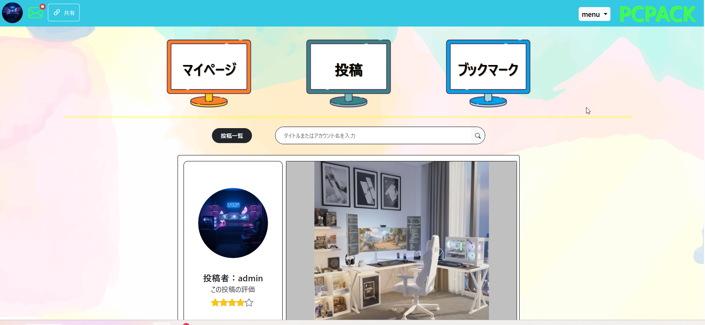

# PCPACK
PCゲーム部屋のこだわりを共有し、評価し合えるコミュニティアプリ

---

## 📸 アプリ概要

PCゲーム部屋の写真を投稿し、他のユーザーと評価・コメントを通して交流できるサービスです。

- 自分のこだわりのゲーム部屋を紹介できる  
- 他ユーザーの部屋を参考にレイアウトや機材選びのヒントを得られる  
- 投稿者に直接 DM で質問できる  
- お気に入りの部屋をブックマークして保存できる  

---

## 🎯 このサービスを作った理由

PC を組んだり周辺機器を揃えるのが好きな一方で、  
机周りや家具の配置に悩むことが多く、他の人の部屋を参考にしたいと思ったのがきっかけです。

- もっと多くの人のゲーム部屋を見たい  
- 自分の知らない機材を知りたい  
- 同じ悩みを持つ人の役に立ちたい  

そんな思いから、このアプリを開発しました。

---

## 👤 想定ユーザー

- 自分の PC ゲーム部屋を自慢したい人  
- ゲーム部屋のレイアウトに悩んでいる人  
- 周辺機器の情報を知りたい人  
- 他の人の部屋を参考にしたい人  

---

## 🧩 機能一覧

### 🔹 MVP（初期リリース）
- ユーザー登録 / ログイン（Devise）
- 部屋の投稿（最大5枚の画像）
- コメント機能
- ブックマーク機能
- 一覧表示・詳細表示
- 感性評価・星評価機能

### 🔹 本リリース
- ソート機能（評価順・ブックマーク数など）
- DM（チャット）機能
- 通知機能
- おすすめ機材のリンク共有

---

## 🛠 使用技術


### バックエンド
- Ruby 3.2.3  
- Rails 7.2.2.2  
- Cloudinary（画像アップロード・画像変換） 
- Ransack（検索・ソート）  
- Kaminari（ページネーション）  
- Devise（認証）

### フロントエンド
- HTML / CSS / Bootstrap  
- JavaScript
- Swiper.js（投稿詳細ページの画像スライダー）


### インフラ / 開発環境
- Fly.io（本番環境）
- PostgreSQL（データベース）
- Cloudinary（画像ストレージ）
- Docker / Docker Compose（開発環境）
- GitHub Actions（CI/CD）
 

---

## 🐳 Docker を使用した開発環境

本アプリは Docker を使用して開発環境を構築しています。

### 起動方法

```
docker-compose build
docker-compose up
```

### コンテナ内でのコマンド例

```
docker exec -it app rails db:migrate
docker exec -it app rails c
```

### 使用しているサービス
- Ruby / Rails（app コンテナ）
- PostgreSQL（db コンテナ）
- Cloudinary（画像アップロード）

## 🖥 画面イメージ（スクリーンショット）


### トップページ

トップページではいろいろな投稿がランダムで表示されます。  
マイページ、投稿ページ、ブックマークページなど、さまざまなページへアクセスできます。


### 投稿詳細

詳細ページでは感性で評価する機能と星を使って点数をつける機能があります。  
星の点数はマイページで総スコアとして確認できます。


---

## 🚀 デプロイ方法（Fly.io）

```
fly deploy
```

---

## 📚 今後のアップデート予定

- DM 機能の強化(宛先の検索機能など)  
- おすすめ機材のデータベース化  
- レコメンド機能の実装  

---

## 📝 ライセンス
MIT License

---

## 👤 作者
翔  
PCゲーム部屋の構造美と機材へのこだわりを共有するために開発しました。  
GitHub: https://github.com/buriki8823/PCPACK  
アプリ：https://pcpack-app.com